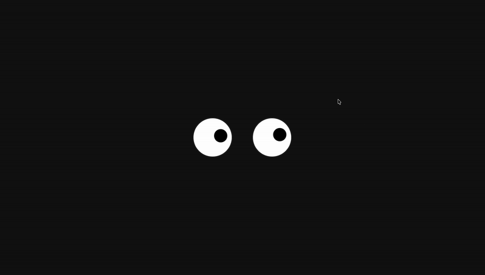

# 👀 Eye Tracker Animation

A small interactive web project where **two eyes follow your mouse cursor** and **blink naturally** — just like real ones.  
Built using **HTML, CSS, and JavaScript**, this project demonstrates simple yet smooth animation and user interactivity in the browser.

---

## 🌟 Features

- 🧿 Eyes smoothly follow your mouse pointer  
- 😴 Auto sleep mode when inactive (eyes close after a few seconds)  
- 😉 Random blinking for a more natural look  
- 💻 Responsive design — works on any screen size  
- ⚡ Lightweight and pure JavaScript (no libraries)

---

## 🧩 How It Works

- **JavaScript** calculates the direction from each eye’s center to the mouse position.  
- **Pupils** move toward that direction smoothly using a simple interpolation formula.  
- **CSS animations** handle blinking by scaling the eyelid element vertically.  
- If no user activity (mouse, keyboard, or touch) is detected for 3.5 seconds, the eyes "fall asleep."

---

## 🧠 Technologies Used

| Language / Tool | Purpose |
|------------------|----------|
| **HTML** | Structure of the eyes and page layout |
| **CSS** | Styling, shadows, and blinking animation |
| **JavaScript** | Eye movement logic and interactivity |

---

## 🚀 How to Run

1. Clone or download this repository  
   	•	git clone https://github.com/SaweliKudasow/Eyes.git
2.	Open index.html in your browser
3.	Move your mouse around — the eyes will follow you 

---

## 🎨 Customization

You can easily change:
	•	Eye size → adjust .eye width/height in CSS
	•	Pupil size → modify .pupil dimensions
	•	Blink speed → tweak transition times in .eye::after
	•	Idle time → edit IDLE_MS in script.js

---

## 📸 Preview

---

## 🧑‍💻 Author

Saweli Kudasow

---

## 📜 License

This project is free to use for educational purposes.